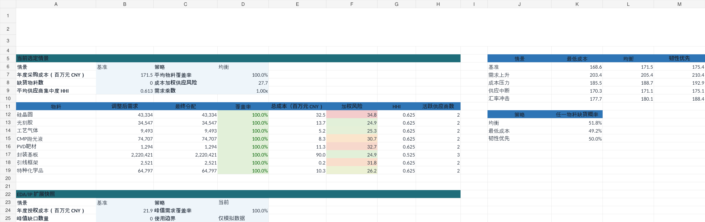
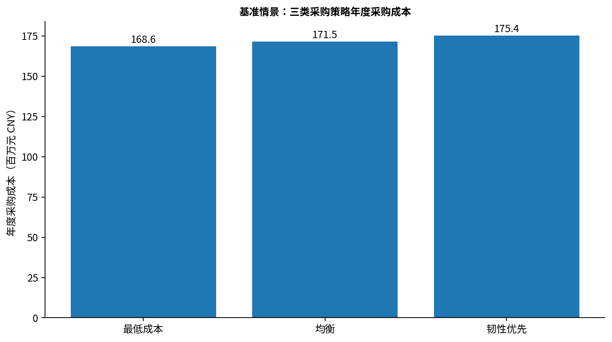
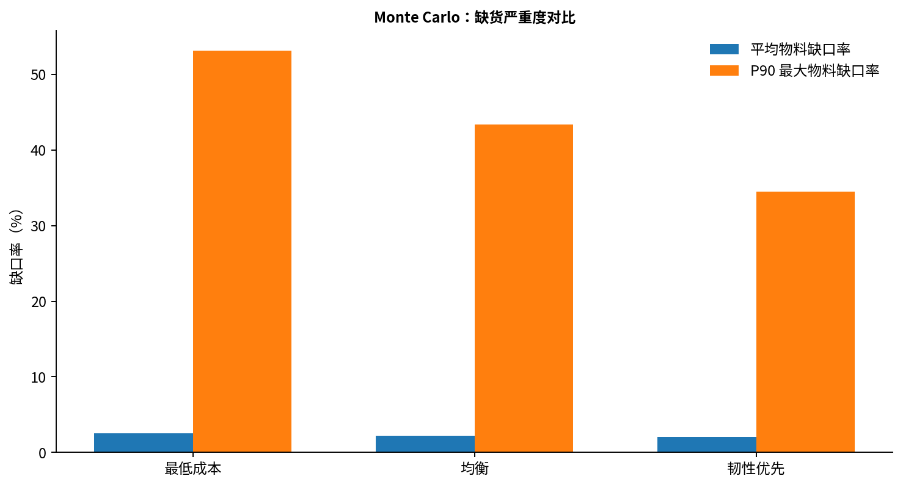
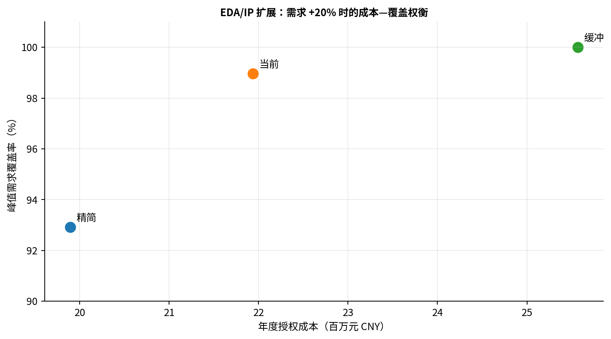

# 半导体采购成本—需求—供应风险分析平台

> 一个面向半导体与制造业采购 / Commodity / 供应链分析岗位的 Python + Excel 项目。  
> 核心问题：在需求、价格、产能、交期和汇率变化下，如何比较不同采购组合的成本与供应风险，并把同一分析框架扩展到 EDA/IP 授权采购。



## 项目定位

本项目构建了从**模拟采购数据 → 数据校验 → 供应商指标 → 成本/风险模型 → 情景分析 → Monte Carlo 压力测试 → Excel 交互看板 → EDA/IP 扩展**的完整分析链。

适合展示的能力包括：

- Python 数据清洗与指标计算
- 采购总成本与供应风险分析
- 供应商集中度与供应韧性比较
- 需求 / 价格 / 产能 / 汇率情景分析
- Monte Carlo 随机压力测试
- Excel 可编辑采购决策模型
- EDA/IP License 需求与授权成本分析

## 业务问题

模型比较三类采购策略：

| 策略 | 逻辑 |
|---|---|
| 最低成本 | 优先选择调整后到岸成本最低的供应商 |
| 均衡 | 同时考虑成本与供应风险 |
| 韧性优先 | 更强调供应风险与多供应商分散 |

并设置五类确定性情景：

**基准 / 需求上升 / 成本压力 / 供应中断 / 汇率冲击**

## 关键结果

在当前模拟参数下：

- 基准情景最低成本策略年度采购成本约 **168.6 百万元**。
- 均衡策略约 **171.5 百万元**，较最低成本增加约 **1.7%**，但模型供应风险由 **39.1** 降至 **33.8**。
- 韧性优先策略约 **175.4 百万元**，进一步降低模型供应风险与供应商集中度。
- 600 次 Monte Carlo 中，三类策略“至少一种物料发生缺口”的概率接近，因此**缺口严重度比单次事件发生概率更适合区分策略**。
- P90 最大物料缺口率由最低成本的 **53.1%**，降至均衡的 **43.3%**，再降至韧性优先的 **34.5%**。





## EDA/IP 授权采购扩展

针对 EDA/IP 采购，本项目把“实物供应”的分析逻辑转换为：

**授权数量 → 峰值并发需求 → 年度授权成本 → 峰值覆盖 → 资源缺口**

在“需求 +20%”模拟中，精简策略会出现峰值覆盖不足，而缓冲策略可以维持完整峰值覆盖，但需要更高年度授权成本。



## Excel 交互模型

`model/半导体采购成本_需求_供应风险决策模型.xlsx`

工作簿包含：

1. 使用说明
2. 参数设置
3. 供应商与报价数据
4. 需求预测
5. 成本 / 风险 / 分配模型
6. 物料汇总
7. 情景分析
8. Monte Carlo 结果
9. EDA/IP 扩展
10. 采购决策看板

黄色输入单元格可修改需求、价格、产能、交期、汇率与采购策略。

## Python 运行

推荐 Python 3.10+。

```bash
pip install -r requirements.txt
python src/run_all.py
```

运行顺序：

```text
00_generate_synthetic_data.py
01_validate_data.py
02_compute_metrics.py
03_run_scenarios.py
04_monte_carlo.py
05_eda_ip_extension.py
```

## 仓库结构

```text
semiconductor-procurement-risk-analysis/
├─ README.md
├─ requirements.txt
├─ data/          # 模拟原始数据
├─ src/           # Python 分析脚本
├─ outputs/       # 模型结果
├─ model/         # Excel 可编辑决策模型
├─ report/        # 正式分析报告
├─ docs/          # 方法、数据字典、边界与发布说明
└─ assets/        # README / 报告展示图片
```

## 数据与项目边界

**本仓库中的供应商名称、报价、产能、交期、质量、采购历史以及 EDA/IP 授权费用均为模拟数据。**

本项目用于展示采购分析方法，不代表：

- 真实供应商报价
- 真实采购合同或 BOM 成本
- 真实 Vendor 谈判
- 真实采购节省
- 企业内部供应商管理经验
- 对任何真实公司的采购建议

详细说明见：[数据与项目边界](docs/数据与项目边界.md)。

## 简历可用表述

可准确表述为：

> 基于模拟供应商报价、需求预测、产能、交期及质量数据建立采购分析数据集，使用 Python 完成数据清洗、供应商指标计算及需求—供应匹配；建立成本—风险模型并设置需求、价格、产能和汇率情景，通过 Monte Carlo 比较不同采购策略的成本分布与物料缺口严重度，并使用 Excel 构建可编辑采购决策看板；扩展 EDA/IP License 需求与授权成本分析模块。

不建议表述为“具备真实供应商管理或采购谈判经验”。

## 交付物

- `model/半导体采购成本_需求_供应风险决策模型.xlsx`
- `report/半导体采购成本_需求_供应风险分析报告.docx`
- `src/` 完整 Python 流水线
- `data/` 模拟数据集
- `outputs/` 可复核分析结果
